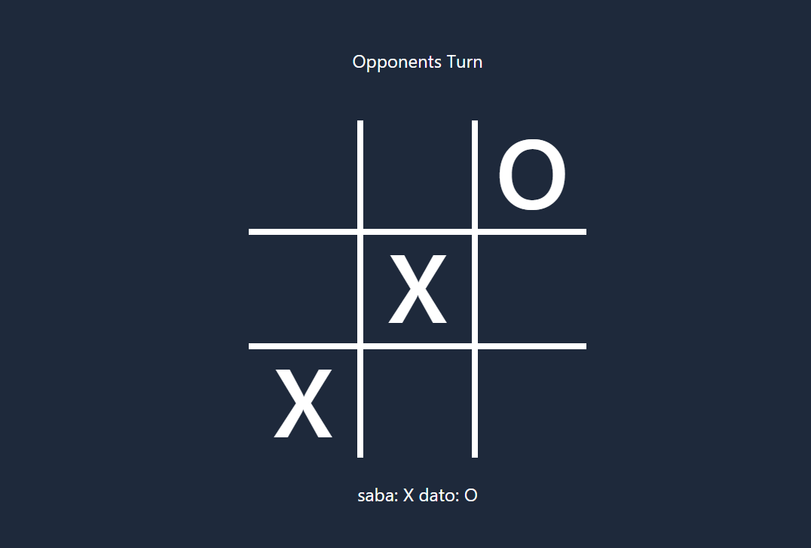
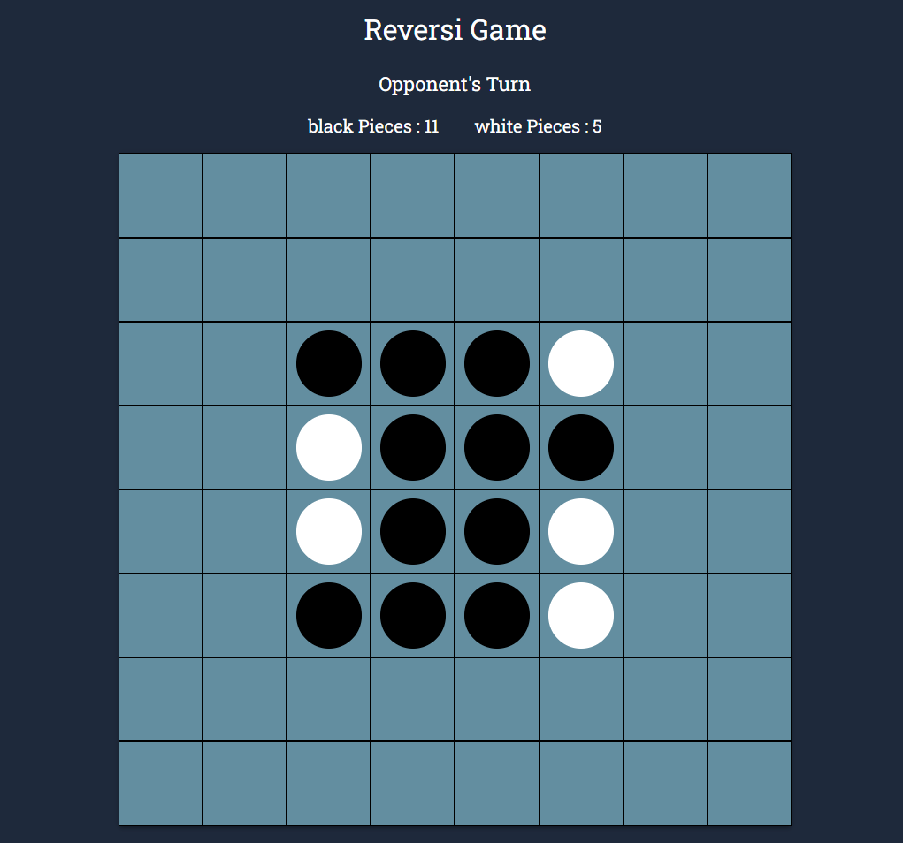

# Multiplayer Gaming Platform - Tic-Tac-Toe and Reversi Games

Welcome to the Multiplayer Gaming Platform! This platform offers a real-time multiplayer gaming experience, featuring classic Tic-Tac-Toe and Reversi games. Users can enter their names, wait for another player to join, and enjoy competitive gaming sessions. The platform supports multiple game sessions concurrently, providing a seamless experience for users to enjoy and compete with friends.

## Screenshots

## How to Use

1. Open the platform in your browser and enter your Name.
2. Either create a game session or join an existing game
3. You can also test game all by yourself by opening the platform in a another window and joining from there.
4. Enjoy multiplayer Tic-Tac-Toe and Reversi with friends!

## Features

-   **Multiplayer Tic-Tac-Toe**: Engage in exciting multiplayer Tic-Tac-Toe matches where two players can compete against each other.
-   **Multiplayer Reversi**: Enjoy strategic multiplayer Reversi games, providing a fresh gaming experience.
-   **User Registration**: Users can enter their names to participate in a game session.
-   **Real-Time Gameplay**: The game board and moves are synchronized in real-time using Socket.IO, ensuring a smooth and interactive gaming experience.
-   **Multiplayer Experience**: These games require 2 players to play. Users can open the game in a second browser to join a game session.
-   **Game Termination**: Inactive users are automatically detected, and if a player remains inactive for too long, the game is terminated.
-   **Rematch Option**: After a game concludes, players have the option to play again against the same opponent.

## Technology Stack

-   **Frontend**: Built with ReactJS for the user interface, real-time updates powered by Socket.IO, and styled using Tailwind CSS and Material-UI.
-   **Backend**: Developed using ExpressJS to handle game logic, Socket.IO for real-time communication, and to manage game sessions.
-   **Styling**: Styled using Tailwind CSS and Material-UI for a modern and responsive design.

## Future Enhancements

-   Support for Additional Games: Expand the platform to offer a variety of multiplayer games.
-   User Profiles: Implement user profiles to track statistics, achievements, and game history.
-   Enhanced Termination Handling: Improve the user experience by providing clearer notifications about game termination due to inactivity.

## Links

-   GitHub Repository: [github.com/abramishvilisaba/multiplayer-gaming-platform](https://github.com/abramishvilisaba/multiplayer-gaming-platform)
-   Live Demo: [multiplayer-gaming-platform-s4nw.onrender.com](https://multiplayer-gaming-platform-s4nw.onrender.com/)

## Contributing

Contributions to this project are welcome! If you have ideas for enhancements or encounter issues, feel free to open an issue or submit a pull request.

## License

This project is licensed under the [MIT License](LICENSE). Feel free to use, modify, and distribute the code for your purposes.

## Author

-   GitHub: [abramishvilisaba](https://github.com/abramishvilisaba)

Start playing and enjoy the multiplayer gaming experience!
